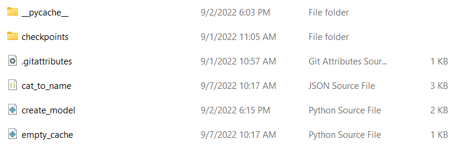

## Intro
Code for subscription for Final Project of Udacity AI Programming with Python Nanodegree.

This is a Python Command Line Application that can do two things:
1. Create a model based on the architecture of an efficient deep neural network, adapt it for the specfic problem, train the network, and save the model to a directory.
2. Use the trained model from number part 1. to classify an image.

## Dependencies

Python 3, PyTorch 0.4, Pillow

## Getting started

### Preprocess image folder file path

The image folder needs to be preprocessed as required by the PyTorch documentation for the [ImageFolder object](https://pytorch.org/vision/stable/generated/torchvision.datasets.ImageFolder.html)

### Train a model

After downloading the code, create a folder to contain the checkpoint file .pth after training as below.
<p align="center">  </p>
Open the Command Prompt at the location of the folder. It is recommended to use an IDE such as Visual Studio Code.

To start training the model, the simplest way is to use the default `train.sh` file:
```
sh train.sh
```
For customization, all the parameters available at the moment are:
```
python train.py data_dir --save_dir checkpoints --arch densenet121 --learning_rate 0.002 --hidden_units 512 --epochs 3 --gpu
```
Refer to the docstring of `get_input_args.py` for help.
Results of training (training loss, validation loss, validation accuracy) will be printed out in the Command Prompt. The testing loss and accuracy will be printed out after training finishes. The trained model will be save to `--save_dir` file path.
Example final ouput:
```
Test accuracy: 79.5%
```
### Predict an image

Again, one can change the image path in the `predict.sh` file and run
```
sh predict.sh
```
to get the result.

For customizatin, all the parameters available at the moment are:
```
python predict.py image_path checkpoint --top_k 5 --category_names cat_to_name.json --gpu
```
Again, refer to the docstring of `get_input_args.py` for help.
